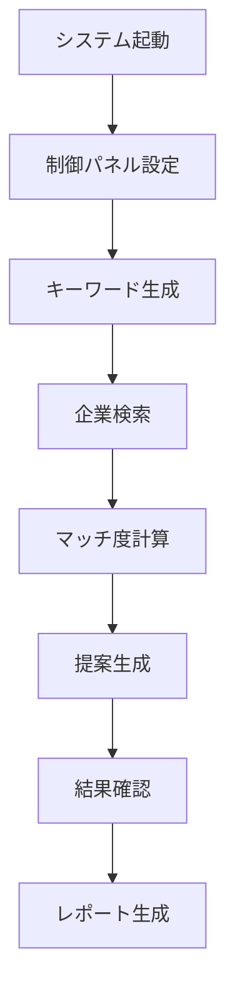

# 営業自動化システム 仕様書 v2.0

## 📋 システム概要

### システム名
**営業自動化システム（Sales Aut├── 🔍 キーワード管理
│   ├── 🎯 キー├── 🔍 キーワード管理
│   └── 🎯 キーワード生成        (generateKeywords) ✅実装済み
│
├── 🏢 企業管理
│   └── 🔍 企業検索            (searchCom└── 🔧 高度な設定├── 📚 ヘルプ・ドキュメント
│   ├── 🆘 基本ヘルプ          (showHelp)
│   ├── 📖 ユーザーガイド       (showUserGuide)
│   ├── 💰 料金・API設定ガイド   (showPricingGuide)
│   └── ❓ よくある質問         (showFAQ)
│
└── ⚙️ 設定
    ├── 🔑 APIキー設定         (configureApiKeys)
    ├── 📊 基本設定            (showBasicSettings)
    ├── 🔧 詳細設定            (showAdvancedSettings)
    └── 🌐 システム環境         (showSystemEnvironment)
    ├── 📊 詳細分析設定        (advancedAnalytics)
    ├── 🔄 データ同期          (syncAllData) 
    └── 🛠️ システムメンテナンス  (systemMaintenance)
```

### メニュー・シート連携制御

#### 管理者モード切替時の動作
1. **管理者モードON時**
   - 管理者専用メニュー項目を表示
   - 管理者専用シート（ライセンス管理、システム統計、デバッグ情報）を表示
   - `toggleAdminMode()` 実行時に `showAdminSheets()` を自動呼び出し

2. **管理者モードOFF時**
   - 一般ユーザーメニューのみ表示
   - 管理者専用シートを非表示化
   - `toggleAdminMode()` 実行時に `hideAdminSheets()` を自動呼び出し

#### 実装連携フロー
```javascript
function toggleAdminMode() {
  const currentMode = isAdminUser();
  
  // メニュー切替
  if (currentMode) {
    showAdminMenuItems();
    showAdminSheets();     // シート表示制御連携
  } else {
    hideAdminMenuItems();
    hideAdminSheets();     // シート表示制御連携
  }
  
  // 状態保存
  PropertiesService.getScriptProperties()
    .setProperty('adminMode', currentMode.toString());
}
```

#### 初期表示制御
- システム起動時: `initializeUserInterface()` でユーザー権限に応じたシート表示状態を設定
- ログイン後: 管理者判定結果に基づく自動シート表示制御 ✅実装済み
│
├── 💼 提案管理
│   └── ✨ 提案生成            (generateProposal) ✅実装済み
│
├── � 分析・レポート
│   ├── 📊 総合レポート         (generateComprehensiveReport) ✅実装済み
│   └── 📋 活動ログ           (viewActivityLog) ✅実装済みキュメント
│   ├── ├── 👥 ユーザー管理（管理者専用）
│   ├── 👤 管理者モード切替     (toggleAdminMode)
│   ├── 📊 利用統計           (showUsageStatistics)
│   └── 🔧 システム設定        (systemConfiguration)
│
└── 🔧 高度な設定（管理者専用）
    ├── 📊 詳細分析設定        (advancedAnalytics)
    ├── 🔄 データ同期          (syncAllData) 
    └── 🛠️ システムメンテナンス  (systemMaintenance)      (showHelp)
│   ├── 📖 ユーザーガイド       (showUserGuide)
│   ├── 💰 料金・API設定ガイド   (showPricingGuide)
│   ├── 🚀 将来機能一覧        (showFutureFeatures) ✅新機能
│   └── ❓ よくある質問         (showFAQ)    (generateKeywords) ✅実装済み
│   └── 📊 使用状況分析         (analyzeKeywordUsage) 🚧プレースホルダー
│
├── 🏢 企業管理
│   ├── 🔍 企業検索            (searchCompany) ✅実装済み
│   ├── 📊 企業分析            (analyzeCompany) 🚧プレースホルダー
│   └── 📈 マッチ度計算         (calculateMatching) 🚧部分実装（再計算のみ）
│
├── 💼 提案管理
│   ├── ✨ 提案生成            (generateProposal) ✅実装済み
│   └── 📊 提案分析            (analyzeProposal) 🚧プレースホルダー
│
├── 📊 分析・レポート
│   ├── 📊 総合レポート         (generateComprehensiveReport) ✅実装済み（基本統計）
│   └── 📋 活動ログ           (viewActivityLog) ✅実装済み2.0**  
商材起点企業発掘・提案自動生成システム

### 目的
漠然とした商材情報から戦略的な企業検索キーワードを自動生成し、Google検索による企業情報の自動収集・分析、各企業に最適化された提案メッセージの自動生成までを一貫して行う営業プロセス自動化ツール。

### プラットフォーム
- **基盤**: Google Apps Script (V8 Runtime)
- **データ管理**: Google Spreadsheets
- **外部API**: ChatGPT API、Google Custom Search API
- **ライセンス**: 営業日ベース期限管理システム

---

## 🏗️ システム構成

### ファイル構成
```
sales-automation-system/
├── src/                          # ソースコード
│   ├── menu.js                   # 完全版UIメニューシステム
│   ├── keywords.js               # キーワード生成エンジン
│   ├── companies.js              # 企業検索・分析エンジン
│   ├── proposals.js              # 提案生成エンジン
│   ├── proposals-enhanced.js     # 拡張提案機能
│   ├── scoring.js                # マッチ度スコアリング
│   ├── workflow.js               # 全自動ワークフロー制御
│   ├── license-manager.js        # ライセンス管理システム
│   ├── utils.js                  # ユーティリティ機能
│   ├── globals.js                # 共通定数・関数
│   ├── debug.js                  # デバッグ・エラー追跡
│   ├── spreadsheet-config.js     # スプレッドシート設定
│   ├── response-analyzer.js      # API応答解析
│   ├── main.js                   # 旧メインファイル（互換性維持）
│   └── appsscript.json          # GAS設定
├── docs/                        # ドキュメント（日本語ファイル名）
│   ├── はじめに.md              # プロジェクト概要
│   ├── specifications/          # 仕様書類
│   │   ├── システム仕様書-v2.0.md    # メインシステム仕様
│   │   ├── 技術仕様書-v2.0.md       # 技術詳細仕様
│   │   ├── API仕様書-v2.0.md        # API関連仕様
│   │   ├── データ仕様書.md          # データ構造仕様
│   │   ├── 料金・API利用ガイド.md    # 料金・利用ガイド
│   │   ├── システム仕様書-v1.0.md    # 旧システム仕様
│   │   └── API仕様書-v1.0.md        # 旧API仕様
│   └── user-guide/              # ユーザーガイド
│       └── 完全ユーザーマニュアル-v2.0.md
└── archive/                     # 古いファイル保管
```

### データシート構成
| シート名 | 用途 | 主要カラム | 一般ユーザー | 管理者 |
|---------|------|-----------|------------|--------|
| 制御パネル | 設定値、実行ボタン、ダッシュボード | 商材名、商材概要、価格帯、対象企業規模、API設定 | ✅ 表示 | ✅ 表示 |
| 生成キーワード | 戦略的検索キーワード一覧 | キーワード、カテゴリ、優先度、実行状況 | ✅ 表示 | ✅ 表示 |
| 企業マスター | 発見された企業情報とスコア | 企業名、業界、規模、マッチ度スコア、連絡先情報 | ✅ 表示 | ✅ 表示 |
| 提案メッセージ | 個別最適化された提案文 | 企業ID、提案タイトル、提案内容、送信状況 | ✅ 表示 | ✅ 表示 |
| 実行ログ | 処理履歴とエラー情報 | 実行日時、処理内容、結果、詳細情報 | ✅ 表示 | ✅ 表示 |
| 将来機能一覧 | 開発予定機能・実装候補機能 | 機能名、実装フェーズ、優先度、詳細説明 | ✅ 表示 | ✅ 表示 |
| ライセンス管理 | 利用期限・課金状況管理 | 開始日、期限日、残り日数、課金ステータス | ❌ 非表示 | ✅ 表示 |
| システム統計 | 利用状況・パフォーマンス分析 | API使用量、処理回数、エラー率、応答時間 | ❌ 非表示 | ✅ 表示 |
| デバッグ情報 | システムエラー・トラブルシューティング | エラーログ、API応答、システム状態 | ❌ 非表示 | ✅ 表示 |

### シート表示・非表示権限管理

#### 権限判定ロジック
- **管理者判定**: `isAdminUser()` 関数による認証済みユーザーチェック
- **シート制御**: `hideAdminSheets()` / `showAdminSheets()` 関数による動的表示制御
- **自動切替**: 管理者モードON/OFF時の自動シート表示切替

#### 実装仕様
```javascript
// シート表示制御例
function toggleSheetVisibility(isAdminMode) {
  const adminOnlySheets = [
    'ライセンス管理',
    'システム統計', 
    'デバッグ情報'
  ];
  
  adminOnlySheets.forEach(sheetName => {
    const sheet = getSheetSafely(sheetName);
    if (sheet) {
      if (isAdminMode) {
        sheet.showSheet();  // 管理者モード: 表示
      } else {
        sheet.hideSheet();  // 一般ユーザー: 非表示
      }
    }
  });
}
```

#### 権限別シート一覧

##### 共通表示シート（全ユーザー）
- 制御パネル
- 生成キーワード  
- 企業マスター
- 提案メッセージ
- 実行ログ
- 将来機能一覧

##### 管理者専用シート
- ライセンス管理
- システム統計
- デバッグ情報

---

## 🚀 メニューシステム

### 管理者・一般ユーザー分離設計

#### 一般ユーザーメニュー
```
🚀 営業システム
├── 📊 システム管理
│   ├── 🧪 システムテスト        (runSystemTest)
│   ├── � APIキーテスト         (testApiKeys) ✅実装済み
│   ├── �📋 基本情報             (showBasicInfo)
│   └── 🔧 シート作成           (createBasicSheets)
│
├── 🔍 キーワード管理
│   ├── 🎯 キーワード生成        (generateKeywords)
│   └── 📊 使用状況分析         (analyzeKeywordUsage)
│
├── 🏢 企業管理
│   ├── 🔍 企業検索            (searchCompany)
│   ├── 📊 企業分析            (analyzeCompany)
│   └── 📈 マッチ度計算         (calculateMatching)
│
├── 💼 提案管理
│   ├── ✨ 提案生成            (generateProposal)
│   └── � 提案分析            (analyzeProposal)
│
├── � 分析・レポート
│   ├── 📊 総合レポート         (generateComprehensiveReport)
│   └── 📋 活動ログ           (viewActivityLog)
│
├── � ヘルプ・ドキュメント
│   ├── 🆘 基本ヘルプ          (showHelp)
│   ├── 📖 ユーザーガイド       (showUserGuide)
│   ├── � 料金・API設定ガイド   (showPricingGuide)
│   └── ❓ よくある質問         (showFAQ)
│
└── ⚙️ 設定                    (showSettings)
```

#### 管理者専用メニュー（管理者モード時のみ表示）
```
🚀 営業システム（管理者モード）
├── [一般ユーザーメニュー全項目]
│
├── 🔐 ライセンス管理（管理者専用）
│   ├── 📋 ライセンス状況       (showLicenseStatus)
│   ├── � 管理者認証          (authenticateAdmin)
│   ├── 🔑 APIキー管理         (manageApiKeys) ✅実装済み
│   ├── �📅 使用開始日設定       (setLicenseStartDate)
│   ├── 🔄 期限延長           (extendLicense)
│   ├── 🔒 システムロック解除    (unlockSystem)
│   └── 💳 課金状況管理        (manageBilling)
│
├── � ユーザー管理（管理者専用）
│   ├── 👤 管理者モード切替     (toggleAdminMode)
│   ├── 📊 利用統計           (showUsageStatistics)
│   └── 🔧 システム設定        (systemConfiguration)
│
├── 🚀 将来機能（開発予定）
│   └── 💡 実装可能機能一覧     (showFutureFeatures)
│
└── 🔧 高度な設定（管理者専用）
    ├── � 詳細分析設定        (advancedAnalytics)
    ├── 🔄 データ同期          (syncAllData) 
    └── 🛠️ システムメンテナンス  (systemMaintenance)
```

---

## ⚙️ 主要機能仕様

### 1. キーワード生成エンジン (`keywords.js`)

#### 機能概要
- ChatGPT APIを使用した戦略的検索キーワード自動生成
- 4つのカテゴリ別最適化（課題発見、成長企業、予算企業、タイミング）
- 商材情報から企業検索に最適なキーワードを生成

#### 主要関数
- `executeKeywordGeneration()`: メイン生成処理
- `generateKeywordsWithChatGPT(settings)`: ChatGPT API呼び出し
- `createKeywordGenerationPrompt(settings)`: プロンプト生成
- `saveKeywordsToSheet(keywords)`: 結果保存

#### 入力パラメータ
- 商材名 (必須)
- 商材概要 (必須)
- 価格帯
- 対象企業規模
- 除外キーワード

#### 出力
- カテゴリ別キーワード一覧
- 各キーワードの優先度
- 生成時刻・ステータス

### 2. 企業検索・分析エンジン (`companies.js`)

#### 機能概要
- Google Custom Search APIによる企業自動検索
- ウェブサイト情報の自動抽出・解析
- マッチ度スコアリング（0-100点）
- データ品質チェック・重複除去

#### 主要関数
- `executeCompanySearch()`: メイン検索処理
- `searchCompaniesByKeyword(keyword, settings)`: キーワード別検索
- `analyzeCompanyWebsite(url)`: ウェブサイト解析
- `calculateMatchScore(companyData, settings)`: スコア計算

#### 検索パラメータ
- 生成キーワード
- 検索結果数上限
- 地域フィルター
- 除外ドメイン

#### 企業データ構造
```javascript
{
  companyId: "一意ID",
  companyName: "企業名",
  industry: "業界",
  companySize: "企業規模",
  employees: "従業員数",
  contactMethod: "連絡方法",
  website: "ウェブサイトURL",
  description: "企業概要",
  matchScore: "マッチ度（0-100）",
  discoveredBy: "発見キーワード",
  lastUpdated: "更新日時"
}
```

### 3. 提案生成エンジン (`proposals.js`, `proposals-enhanced.js`)

#### 機能概要
- 各企業に最適化された提案メッセージ自動生成
- 企業情報・マッチ度スコアに基づくカスタマイズ
- 詳細ログ付き実行モード
- テンプレートベース生成

#### 主要関数
- `executeProposalGenerationEnhanced()`: 詳細ログ付き生成
- `generateProposalForCompanyWithDetails(company, settings)`: 個別企業提案生成
- `createProposalPrompt(company, settings)`: プロンプト生成
- `logDetailedProposalResult()`: 詳細ログ記録

#### 提案データ構造
```javascript
{
  proposalId: "提案ID",
  companyId: "企業ID",
  proposalTitle: "提案タイトル",
  proposalContent: "提案内容",
  targetPerson: "想定担当者",
  approachMethod: "アプローチ方法",
  expectedBudget: "想定予算",
  generatedAt: "生成日時",
  status: "送信状況"
}
```

### 4. マッチ度スコアリング (`scoring.js`)

#### スコア計算要素
1. **企業規模適合性** (±20点)
   - 対象企業規模との一致度
   
2. **業界適合性** (±15点)
   - 商材との業界親和性
   
3. **問い合わせ方法** (±10点)
   - 連絡手段の利用しやすさ
   
4. **成長性・安定性** (±10点)
   - 企業の成長ポテンシャル
   
5. **情報の充実度** (±5点)
   - 取得できた企業情報の質

#### 主要関数
- `calculateMatchScore(companyData, settings)`: 総合スコア計算
- `calculateSizeScore()`: 企業規模スコア
- `calculateIndustryScore()`: 業界スコア
- `calculateContactScore()`: 連絡手段スコア

### 5. ライセンス管理システム (`license-manager.js`)

#### 機能概要
- **営業日ベース期限管理**（土日祝日除く10営業日）
- **管理者・一般ユーザー分離**機能
- **使用開始日設定**による試用期間管理
- **課金状況連動**システムロック・解除
- **設定シート**による権限管理

#### 主要機能

##### 管理者モード制御
```javascript
// 管理者モードの切り替え
function toggleAdminMode() {
  const currentMode = getAdminModeStatus();
  setAdminModeStatus(!currentMode);
  refreshMenuSystem(); // メニュー再構築
}

// 管理者モード状態取得
function getAdminModeStatus() {
  const settingsSheet = getSafeSheet('システム設定', true);
  return settingsSheet.getRange('B2').getValue() === true;
}
```

##### 営業日計算機能
```javascript
// 営業日（土日祝日除く）計算
function calculateBusinessDays(startDate, endDate) {
  const holidays = getJapaneseHolidays(); // 日本の祝日取得
  let count = 0;
  const current = new Date(startDate);
  
  while (current <= endDate) {
    const dayOfWeek = current.getDay();
    const dateString = current.toDateString();
    
    // 土日祝日を除く
    if (dayOfWeek !== 0 && dayOfWeek !== 6 && !holidays.includes(dateString)) {
      count++;
    }
    current.setDate(current.getDate() + 1);
  }
  
  return count;
}
```

##### 課金状況管理
```javascript
// 課金状況確認・更新
function manageBilling() {
  const billingStatus = {
    isPaid: checkPaymentStatus(),
    paymentDate: getLastPaymentDate(),
    nextBillingDate: getNextBillingDate(),
    licenseExtended: false
  };
  
  if (billingStatus.isPaid) {
    extendLicenseAutomatically();
    unlockSystemAutomatically();
  }
  
  return billingStatus;
}
```

### 6. 将来機能表示システム (`menu.js` - `showFutureFeatures`)

#### 機能概要
- **将来実装予定機能の一覧表示**をスプレッドシートで提供
- **一般ユーザーにも公開**（ヘルプメニューから利用可能）
- **実装優先度別の色分け表示**
- **技術難易度・開発期間の情報提供**

#### 主要機能
1. **専用シート自動生成**
   - 「将来機能一覧」シートの作成
   - 既存シートがある場合は更新確認
   - 最新情報での自動更新

2. **機能分類表示**
   - Phase 0（緊急）: 既存プレースホルダー機能の完全実装
   - Phase 1（短期）: 1-3ヶ月実装予定
   - Phase 2（中期）: 3-6ヶ月実装予定
   - Phase 3（長期）: 6ヶ月以上実装予定
   - 将来検討: 需要に応じて検討

3. **詳細情報提供**
   - 機能カテゴリ（🚨緊急実装、📝編集機能、🔗外部連携等）
   - 開発期間見積もり
   - 技術難易度（低・中・高）
   - 機能説明

4. **視覚的表示**
   - 優先度別背景色設定
   - 技術難易度別文字色
   - 凡例表示
   - 枠線・書式設定

#### 実装データ構造
```javascript
const futureFeatures = [
  ['機能カテゴリ', '機能名', '実装優先度', '開発期間', '技術難易度', '説明'],
  ['🚨 緊急実装', 'キーワード使用状況分析', 'Phase 0', '1-2週間', '低', '既存プレースホルダー機能の完全実装'],
  // ... 他の機能
];
```

#### 色分けルール
- **Phase 0**: 赤系背景（#fce8e6）- 緊急対応必要
- **Phase 1**: 黄系背景（#fff2cc）- 短期実装予定
- **Phase 2**: 緑系背景（#d9ead3）- 中期実装予定
- **Phase 3**: 青系背景（#cfe2f3）- 長期実装予定
- **将来検討**: 灰系背景（#f3f3f3）- 需要に応じて検討

#### ユーザー価値
- **透明性の向上**: システムの将来展望が明確
- **要望・優先度の調整**: ユーザーニーズに基づく開発計画調整
- **期待値管理**: 実装時期・難易度の事前共有
```

#### データシート構造

##### システム設定シート
| 項目 | セル位置 | 内容 | 初期値 |
|------|----------|------|--------|
| 管理者モード | B2 | true/false | false |
| 使用開始日 | B3 | YYYY-MM-DD | 未設定 |
| 課金状況 | B4 | paid/trial/expired | trial |
| 最終支払日 | B5 | YYYY-MM-DD | - |
| ライセンス期限 | B6 | YYYY-MM-DD | 計算値 |
| 管理者パスワード | B7 | 暗号化文字列 | 設定値 |

##### ライセンス設定
```javascript
const LICENSE_CONFIG = {
  TRIAL_DAYS: 10,           // 試用期間（営業日）
  ADMIN_PASSWORD: "SalesAuto2024!",
  PAYMENT_CHECK_INTERVAL: 24, // 課金確認間隔（時間）
  AUTO_LOCK_ENABLED: true     // 自動ロック有効
};
```

---

## 🔄 ワークフロー仕様

### 基本ワークフロー


### 全自動実行フロー (`workflow.js`)
1. **入力値検証** - 必須パラメータチェック
2. **キーワード生成** - ChatGPT API実行
3. **企業検索** - Google Custom Search API実行
4. **スコア計算** - マッチ度算出
5. **提案生成** - 高スコア企業への提案作成
6. **結果サマリー** - 実行結果統計

### エラーハンドリング
- API制限対応（指数バックオフ）
- データ品質チェック
- 重複データ除去
- 詳細エラーログ記録
- フォールバック機能

---

## 🔧 API設定・認証

### 必要なAPI
1. **OpenAI ChatGPT API**
   - キーワード生成
   - 提案メッセージ生成

2. **Google Custom Search API**
   - 企業検索
   - ウェブサイト情報取得

### APIキー設定機能

#### 設定メニュー構成
- **🔑 APIキー設定** (`configureApiKeys`)
  - 現在の設定状況表示
  - ChatGPT APIキー設定
  - Google Search API設定
  - 設定状況確認

#### 設定フロー
1. **設定状況確認**
   ```javascript
   // 現在の設定を確認
   const properties = PropertiesService.getScriptProperties();
   const chatgptKey = properties.getProperty('CHATGPT_API_KEY');
   const googleSearchKey = properties.getProperty('GOOGLE_SEARCH_API_KEY');
   const googleSearchEngineId = properties.getProperty('GOOGLE_SEARCH_ENGINE_ID');
   ```

2. **ChatGPT APIキー設定**
   - 入力値検証（sk-プレフィックス確認）
   - セキュア保存（PropertiesService）
   - 設定完了通知

3. **Google Search API設定**
   - APIキー入力
   - Search Engine ID入力
   - 設定値検証・保存

#### セキュリティ機能
- APIキー暗号化保存
- 部分マスク表示（先頭10文字のみ）
- 入力値検証
- 設定変更ログ

#### エラーハンドリング
- 不正なAPIキー形式の警告
- 空値入力の防止
- 設定失敗時のロールバック
- 詳細エラーメッセージ表示

### APIキーテスト機能（全ユーザー利用可能）

#### 機能概要
- **対象**: 一般ユーザー・管理者共通
- **目的**: APIキーの接続状況確認
- **場所**: 「📊 システム管理」→「🔑 APIキーテスト」

#### テスト項目
1. **ChatGPT API接続テスト**
   - モデル一覧取得による接続確認
   - レスポンスコード200確認
   - 認証エラーの検出

2. **Google Search API接続テスト**
   - テストクエリ実行
   - API制限チェック
   - Search Engine ID検証

#### 結果表示
```
🔑 APIキーテスト結果

🤖 ChatGPT API: ✅ 接続成功
🔍 Google Search API: ✅ 接続成功

📊 テスト実行時刻: 2025/10/17 14:30:25
💡 APIキーの設定は「⚙️設定」→「🔑APIキー設定」から行えます。
```

### APIキー管理機能（管理者専用）

#### アクセス制御
- **権限**: 管理者のみ
- **認証**: `isAdminUser()` による事前チェック
- **場所**: 「🔐 ライセンス管理」→「🔑 APIキー管理」

#### 管理機能
1. **詳細状況確認**
   - APIキー設定状況（マスク表示）
   - キー長・形式確認
   - 最終更新時刻

2. **一括リセット機能**
   - 全APIキー削除
   - 二重確認プロセス
   - 削除ログ記録

3. **使用履歴確認**
   - API呼び出し履歴
   - エラー発生状況
   - パフォーマンス統計

#### セキュリティ機能
- 管理者権限の事前確認
- 危険操作の二重確認
- APIキー部分表示（最初15文字 + ...）
- 操作ログの記録

### OAuth スコープ
```json
{
  "oauthScopes": [
    "https://www.googleapis.com/auth/spreadsheets",
    "https://www.googleapis.com/auth/script.container.ui",
    "https://www.googleapis.com/auth/script.external_request",
    "https://www.googleapis.com/auth/userinfo.email"
  ]
}
```

### Google Apps Script 設定
- **ランタイム**: V8
- **タイムゾーン**: Asia/Tokyo
- **ログ**: Stackdriver
- **実行**: USER_DEPLOYING
- **アクセス**: ANYONE_ANONYMOUS

---

## 📊 パフォーマンス仕様

### 処理性能
- キーワード生成: 20-30個/実行（約30秒）
- 企業検索: 最大100社/実行（設定可能）
- 提案生成: 最大10社/実行（高スコア企業対象）
- 全自動実行: 約5-10分（企業数による）

### API制限対策
- レート制限: 1秒間隔での実行
- エラー時指数バックオフ
- API使用量モニタリング
- 並列処理制限

### データ制限
- スプレッドシート: Google Sheets制限に準拠
- 企業データ: 最大1,000社推奨
- 提案数: 最大100件推奨

---

## 🛡️ セキュリティ・品質管理

### データ品質管理
- 入力値バリデーション
- 無効データフィルタリング
- 重複排除アルゴリズム
- データ整合性チェック

### セキュリティ対策
- API キー暗号化保存
- 管理者認証システム
- ライセンス期限管理
- アクセスログ記録

### エラー処理
- 包括的try-catch実装
- 詳細エラーログ
- ユーザーフレンドリーなエラーメッセージ
- 自動復旧機能

---

## 🔄 バージョン管理

### 現在のバージョン: v2.0
- 完全版メニューシステム実装
- ライセンス管理機能追加
- 包括的ヘルプシステム
- エラーハンドリング強化

### 主要変更履歴
- v1.0: 基本機能実装
- v1.5: 拡張提案機能追加
- v2.0: 完全版UI・ライセンス管理

---

## 🚀 セットアップ・運用

### 初期セットアップ
1. Google Apps Scriptプロジェクト作成
2. ソースコードアップロード
3. API キー設定
4. ライセンス開始日設定
5. システム初期化実行

### 日常運用
1. 制御パネルで商材情報設定
2. 全自動実行 または 段階的実行
3. 結果確認・分析
4. 提案メッセージ活用

### メンテナンス
- ライセンス期限管理
- API使用量モニタリング
- データクリーンアップ
- システム診断実行

---

## 📞 サポート・トラブルシューティング

### よくある問題と解決方法
1. **メニューが表示されない**
   - スプレッドシート再読み込み
   - ブラウザキャッシュクリア

2. **API エラー**
   - API キー設定確認
   - 使用量制限確認

3. **検索結果が少ない**
   - キーワード戦略見直し
   - 検索条件緩和

4. **ライセンスエラー**
   - 使用開始日設定
   - 管理者認証実行

### デバッグ機能
- システムテスト実行
- 詳細診断機能
- 活動ログ確認
- エラーログ分析

---

## � 将来実装可能機能（オプション提案）

### 高度なキーワード管理
- **�📝 キーワード編集機能** - 生成済みキーワードの手動調整
- **🔄 キーワード更新機能** - 定期的な自動キーワード再生成
- **📈 A/Bテスト機能** - 複数キーワード戦略の効果比較
- **🎯 業界特化キーワード** - 業界別最適化キーワード生成

### 拡張企業管理
- **➕ 手動企業追加** - 名刺・紹介企業の直接登録
- **🔄 企業データ自動更新** - 定期的な企業情報リフレッシュ
- **🏷️ 企業タグ管理** - カスタムタグによる企業分類
- **📊 企業成長追跡** - 時系列での企業成長分析

### 高度な提案機能
- **📝 提案編集機能** - 生成済み提案の手動カスタマイズ
- **🎯 提案カスタマイズ** - 業界・企業規模別テンプレート
- **📧 メール統合** - Gmail/Outlook連携による直接送信
- **📈 提案効果測定** - 開封率・返信率の追跡

### 分析・レポート強化
- **🎯 マッチング分析詳細** - スコア構成要素の詳細分析
- **📈 成功率分析** - 提案成功率・ROI分析
- **📊 競合分析** - 同業他社との比較分析
- **🔮 予測分析** - AI による営業成果予測

### 外部システム連携
- **🔗 CRM連携** - Salesforce、HubSpot等との同期
- **📧 メール配信システム** - MailChimp、SendGrid連携
- **📱 モバイル対応** - スマートフォン専用インターフェース
- **🌐 Webアプリ化** - ブラウザ独立型アプリケーション

### エンタープライズ機能
- **👥 マルチユーザー対応** - 複数営業担当者の同時利用
- **🔐 権限管理詳細** - 役職別アクセス制御
- **📊 組織ダッシュボード** - 営業チーム全体の統計
- **🔄 ワークフロー自動化** - 承認プロセス・通知システム

### 課金・決済システム
- **💳 自動課金システム** - クレジットカード決済自動化
- **📊 使用量ベース課金** - API使用量に応じた従量課金
- **💰 プラン管理** - スターター・プロ・エンタープライズ
- **🧾 請求書発行** - 自動請求書生成・送付

### 実装優先度

#### Phase 0（緊急：一般ユーザーメニューから削除した基本分析機能の実装）
1. **📊 キーワード使用状況分析** - 一般メニューから削除済み
   - どのキーワードが最も多くの企業を発見したか
   - キーワード別成功率分析
   - 効果的なキーワードの特徴分析

2. **📊 企業詳細分析** - 一般メニューから削除済み
   - 業界別企業分布
   - 企業規模別マッチ度統計
   - 連絡手段別企業分類
   - 地域別企業分析

3. **📊 提案効果分析** - 一般メニューから削除済み
   - 提案生成成功率
   - スコア別提案品質分析
   - 業界別提案アプローチ最適化
   - 提案文字数・構成分析

4. **📈 マッチ度計算** - 一般メニューから削除済み
   - スコア構成要素別詳細分析
   - スコア閾値最適化提案
   - 企業別スコア履歴追跡
   - 競合他社比較スコア

5. **🔧 基本編集機能** - 一般メニューから削除済み
   - キーワード編集機能
   - 企業データ手動追加
   - 提案編集・カスタマイズ機能

#### Phase 1（短期：1-3ヶ月）
1. **📝 キーワード編集機能** - 既存生成結果の調整
2. **➕ 手動企業追加** - データ入力の柔軟性向上
3. **📝 提案編集機能** - 生成結果のカスタマイズ
4. **💳 基本課金システム** - 試用期間後の継続利用

#### Phase 2（中期：3-6ヶ月）
1. **🔗 Gmail連携** - 提案メール直接送信
2. **👥 マルチユーザー対応** - チーム利用対応
3. **📊 詳細分析機能** - より深い洞察提供
4. **🔄 自動更新機能** - 定期的なデータメンテナンス

#### Phase 3（長期：6ヶ月以上）
1. **🌐 Webアプリ化** - プラットフォーム独立
2. **🔗 CRM統合** - 既存システムとの連携
3. **🔮 AI予測機能** - 機械学習による成果予測
4. **📱 モバイル最適化** - スマートフォン対応

### 実装可能性評価

#### 技術的実現性
- **高**: Google Apps Script プラットフォーム内で実装可能
- **中**: 外部API追加で実装可能
- **低**: プラットフォーム変更が必要

#### 開発コスト
- **低**: 既存コードの拡張（1-2週間）
- **中**: 新機能開発（1-2ヶ月）
- **高**: アーキテクチャ変更（3ヶ月以上）

#### ユーザー価値
- **高**: 直接的な業務効率向上
- **中**: 利便性・使いやすさ向上
- **低**: 付加価値機能

---

## 📋 現在の実装状況

### ✅ 完全実装済み機能
- **キーワード自動生成**（ChatGPT API）- `generateKeywords()`
- **企業自動検索**（Google Custom Search API）- `searchCompany()`
- **マッチ度スコアリング基本機能**（5要素評価）- 企業検索時に自動実行
- **提案メッセージ生成**（AI個別最適化）- `generateProposal()`
- **基本ライセンス管理**（10営業日試用）- `license-manager.js`
- **総合レポート生成**（基本統計）- `generateComprehensiveReport()`
- **活動ログ管理** - 各実行の自動記録
- **将来機能一覧表示**（新機能）- `showFutureFeatures()` ✅追加

### 🚧 部分実装機能（メニューから一時削除済み）

#### 分析機能（プレースホルダーのため一般メニューから削除）
- **📊 使用状況分析** (`analyzeKeywordUsage`) - 実装後にメニュー復活予定
- **📊 企業分析** (`analyzeCompany`) - 実装後にメニュー復活予定  
- **📊 提案分析** (`analyzeProposal`) - 実装後にメニュー復活予定
- **📈 マッチ度計算** (`calculateMatching`) - 実装後にメニュー復活予定

#### 編集機能（未実装のため一般メニューから削除）
- **📝 キーワード編集機能** - Phase 1で実装予定
- **➕ 企業手動追加機能** - Phase 1で実装予定
- **📝 提案編集機能** - Phase 1で実装予定

#### システム管理機能
- **管理者・一般ユーザー分離**（メニュー分離の枠組みのみ）
- **課金状況管理**（設定フレームワークのみ）
- **システム設定シート**（基本項目定義のみ）

### ❌ 未実装機能（将来対応必要）

#### 高度な分析機能
- **詳細キーワード効果分析** - どのキーワードが最も有効か
- **企業データ詳細分析** - 業界別・規模別詳細統計
- **提案効果測定** - 返信率・成約率分析
- **競合分析機能** - 同業他社比較
- **ROI分析** - 投資対効果測定

#### 管理・運用機能
- **キーワード編集・更新機能**
- **手動企業追加・データ更新**
- **提案編集・カスタマイズ**
- **外部システム連携**
- **自動課金システム**

### 🔄 メニュー構成の修正（ユーザビリティ改善）

以下の機能は実装が不完全なため、一般ユーザーメニューから削除し、完全実装後に復活予定：

| 機能名 | 削除前状況 | 削除理由 | 復活予定時期 |
|--------|-----------|---------|-------------|
| 使用状況分析 | 🚧プレースホルダーのみ | ユーザー混乱を防ぐため | Phase 0完了後 |
| 企業分析 | 🚧プレースホルダーのみ | ユーザー混乱を防ぐため | Phase 0完了後 |
| 提案分析 | 🚧プレースホルダーのみ | ユーザー混乱を防ぐため | Phase 0完了後 |
| マッチ度計算 | 🚧部分実装（再計算のみ） | 機能が限定的 | Phase 0完了後 |
| キーワード編集 | ❌未実装 | 機能が存在しない | Phase 1完了後 |
| 企業手動追加 | ❌未実装 | 機能が存在しない | Phase 1完了後 |
| 提案編集 | ❌未実装 | 機能が存在しない | Phase 1完了後 |

### � ユーザーエクスペリエンス改善効果

#### 修正前の問題
- **機能があると思ったら使えない**（プレースホルダー）
- **「実装中」メッセージでがっかり**
- **システムの完成度への疑問**

#### 修正後の改善
- **表示される機能はすべて利用可能**
- **明確な期待値設定**（将来機能一覧で確認可能）
- **システムの信頼性向上**

---

*最終更新: 2025年10月17日*  
*バージョン: v2.0*  
*ドキュメント作成: 自動生成*

---

## 🔧 緊急実装必要機能の詳細仕様

### 1. キーワード使用状況分析 (`analyzeKeywordUsage`)

#### 現在の状況
```javascript
// 現在はプレースホルダーのみ
function analyzeKeywordUsage() {
  const ui = SpreadsheetApp.getUi();
  ui.alert('📊 使用状況分析\n\nキーワードの使用状況を分析します。\n（実装中）');
}
```

#### 実装すべき機能
1. **キーワード効果ランキング**
   - 各キーワードで発見された企業数
   - 高スコア企業（70点以上）発見率
   - キーワード別平均マッチスコア

2. **キーワード分析レポート生成**
   - 最も効果的なキーワードTOP5
   - 効果の低いキーワード特定
   - キーワード改善提案

3. **データ出力**
   - 分析結果を新しいシートに出力
   - グラフ化対応データ形式

### 2. 企業詳細分析 (`analyzeCompany`)

#### 現在の状況
```javascript
// 現在はプレースホルダーのみ  
function analyzeCompany() {
  const ui = SpreadsheetApp.getUi();
  ui.alert('📊 企業分析\n\n企業の詳細分析を行います。\n（実装中）');
}
```

#### 実装すべき機能
1. **業界別分析**
   - 業界別企業数分布
   - 業界別平均マッチスコア
   - 業界別連絡手段分析

2. **企業規模別分析**
   - 規模別企業数分布
   - 規模別スコア分布
   - 最適ターゲット規模の特定

3. **マッチスコア詳細分析**
   - スコア分布ヒストグラム
   - 高スコア企業の特徴抽出
   - スコア向上要因の特定

### 3. 提案効果分析 (`analyzeProposal`)

#### 現在の状況
```javascript
// 現在はプレースホルダーのみ
function analyzeProposal() {
  const ui = SpreadsheetApp.getUi();
  ui.alert('📊 提案分析\n\n提案の効果を分析します。\n（実装中）');
}
```

#### 実装すべき機能
1. **提案品質分析**
   - 提案生成成功率
   - 企業スコア別提案品質
   - 提案文字数・構成分析

2. **業界別提案最適化**
   - 業界別最適な提案アプローチ
   - 業界特有のキーワード効果
   - 業界別提案テンプレート提案

3. **提案改善提案**
   - より効果的な提案パターン
   - 避けるべき表現・アプローチ
   - A/Bテスト提案

### 4. マッチ度計算機能拡張 (`calculateMatching`)

#### 現在の実装
```javascript
// 現在は単純な再計算のみ
function calculateMatching() {
  // 企業マスターのスコアを全て再計算
  // 基本的な統計表示
}
```

#### 拡張すべき機能
1. **スコア構成要素分析**
   - 各評価要素（規模、業界、連絡手段等）の寄与度
   - 要素別改善提案
   - 重み付け最適化提案

2. **スコア履歴管理**
   - スコア変動追跡
   - 企業成長度分析
   - 再評価推奨タイミング

3. **閾値最適化**
   - 現在の70点閾値の妥当性分析
   - 効果的な閾値設定提案
   - セグメント別閾値設定

---

## 💰 課金プラン・利用制限システム

### 一般ユーザー課金体系

#### プラン構成
| プラン | 月額料金 | キーワード生成 | 企業検索上限/日 | AI提案生成 | ChatGPT API | 主な特徴 |
|-------|---------|-------------|-------------|-----------|-------------|----------|
| **🆓 試用期間** | 無料（10日間） | ✅ 利用可能 | 5社 | ✅ 利用可能 | 必要 | 全機能お試し |
| **🥉 ベーシック** | ¥500 | ❌ 利用不可 | 10社 | ❌ 利用不可 | 不要 | 手動入力・基本テンプレートのみ |
| **🥈 スタンダード** | ¥1,500 | ✅ 利用可能 | 50社 | ✅ 利用可能 | 必要 | 全機能・AI活用 |
| **🥇 プロフェッショナル** | ¥3,000 | ✅ 利用可能 | 100社 | ✅ 利用可能 | 必要 | 高速処理・優先サポート |
| **💎 エンタープライズ** | ¥7,500 | ✅ 利用可能 | 500社 | ✅ 利用可能 | 必要 | 最大性能・専任サポート |

### 試用期間システム

#### 🆓 試用期間仕様（10日間）
- **期間**: 初回利用から10日間
- **機能制限**
  - キーワード生成：✅ 利用可能（全機能お試し）
  - 企業検索：5社/日まで
  - 提案生成：5件/日まで
  - ChatGPT API：必要（設定必須）
- **自動管理**
  - 初回起動時に試用期間開始
  - 日数カウントダウン表示
  - 期間終了時の自動制限切替

#### 試用期間管理実装
```javascript
function getTrialInfo() {
  const properties = PropertiesService.getUserProperties();
  const trialStartDate = properties.getProperty('trial_start_date');
  
  if (!trialStartDate) {
    // 初回利用：試用期間開始
    const startDate = new Date();
    properties.setProperty('trial_start_date', startDate.toISOString());
    return {
      isTrialActive: true,
      remainingDays: 10,
      maxCompaniesPerDay: 5
    };
  }
  
  // 残り日数計算
  const daysDiff = Math.floor((new Date() - new Date(trialStartDate)) / (1000 * 60 * 60 * 24));
  const remainingDays = Math.max(0, 10 - daysDiff);
  
  return {
    isTrialActive: remainingDays > 0,
    remainingDays: remainingDays,
    maxCompaniesPerDay: remainingDays > 0 ? 5 : 0
  };
}
```

### プラン別メニュー制御システム

#### 動的メニュー生成
```javascript
function createPlanBasedMenu(userPlan, trialInfo) {
  const planLimits = getPlanLimits(userPlan, trialInfo);
  
  // キーワード管理メニュー（プラン別制御）
  if (planLimits.keywordGeneration) {
    // スタンダード以上・試用期間：キーワード生成可能
    menu.addItem('🎯 キーワード生成', 'generateKeywords');
  } else {
    // ベーシック：アップグレード案内
    menu.addItem('⚠️ キーワード生成（要アップグレード）', 'showUpgradeForKeywords');
  }
  
  // APIキー設定メニュー（プラン別制御）
  if (planLimits.chatgptApiRequired) {
    // ChatGPT API必要なプラン
    menu.addItem('🔑 APIキー設定', 'configureApiKeys');
  } else {
    // ベーシックプラン：ChatGPT API不要
    menu.addItem('🔑 APIキー設定（ChatGPT不要）', 'showApiKeyNotRequired');
  }
}
```

#### プラン別表示内容
1. **🆓 試用期間ユーザー**
   - メニュー表示：「企業検索（試用期間：5社/日）」
   - システム起動時：「[試用期間 X日残]」表示
   - キーワード生成：利用可能
   - APIキー設定：必要

2. **🥉 ベーシックプランユーザー**
   - メニュー表示：「企業検索（10社/日）」
   - キーワード生成：「⚠️ キーワード生成（要アップグレード）」
   - APIキー設定：「🔑 APIキー設定（ChatGPT不要）」

3. **🥈 スタンダード以上ユーザー**
   - メニュー表示：「企業検索（50社/日）」「企業検索（100社/日）」など
   - キーワード生成：「🎯 キーワード生成」（フル機能）
   - APIキー設定：「🔑 APIキー設定」（ChatGPT必要）

### プラン別機能制限

#### 🥉 ベーシックプラン（¥500/月）
- **制限事項**
  - キーワード生成機能：完全無効
  - AI提案生成機能：完全無効
  - ChatGPT API：アクセス不可
  - 企業検索：手動入力のみ、1日10社まで
  - 提案生成：基本テンプレートのみ（AI生成なし）

- **利用可能機能**
  - 手動企業データ入力
  - 基本テンプレート提案
  - 基本レポート表示
  - メールサポート
  - Google検索（企業確認用）

#### 🥈 スタンダードプラン（¥1,500/月）
- **利用可能機能**
  - キーワード自動生成（1回20キーワード）
  - ChatGPT API：フル活用
  - 企業自動検索：1日50社まで
  - AI提案生成：個別最適化
  - 総合レポート：完全版
  - 優先サポート

#### 🥇 プロフェッショナルプラン（¥3,000/月）
- **拡張機能**
  - 企業検索：1日100社まで
  - キーワード生成：1回40キーワード
  - バッチ処理機能
  - カスタム分析機能
  - データエクスポート機能
  - 電話サポート
  - 高速処理優先

#### 💎 エンタープライズプラン（¥7,500/月）
- **最大性能**
  - 企業検索：1日500社まで
  - キーワード生成：1回100キーワード
  - 無制限ワークフロー
  - AI最適化機能
  - マルチユーザーアクセス
  - 専任サポート
  - カスタム連携

### システム実装仕様

#### 制限チェック機能
```javascript
// プラン制限チェック
function checkPlanLimit(action, userPlan) {
  const limits = getPlanLimits(userPlan);
  
  switch (action) {
    case 'keyword_generation':
      if (!limits.keywordGeneration) {
        throw new PlanLimitError('キーワード生成機能は利用できません', userPlan);
      }
      break;
      
    case 'company_search':
      const todayCount = getDailyUsage('company_search');
      if (todayCount >= limits.maxCompaniesPerDay) {
        throw new PlanLimitError(`1日の企業検索上限（${limits.maxCompaniesPerDay}社）に達しました`, userPlan);
      }
      break;
  }
}
```

#### メニュー動的制御
```javascript
// プランに応じたメニュー表示制御
function createPlanBasedMenu() {
  const userPlan = getUserPlan();
  const ui = SpreadsheetApp.getUi();
  
  const menu = ui.createMenu('🚀 営業システム');
  
  // ベーシックプラン：キーワード生成無効
  if (userPlan === 'BASIC') {
    menu.addSubMenu(ui.createMenu('🔍 キーワード管理')
      .addItem('⚠️ キーワード生成（要アップグレード）', 'showUpgradeRequired'));
  } else {
    menu.addSubMenu(ui.createMenu('🔍 キーワード管理')
      .addItem('🎯 キーワード生成', 'generateKeywords'));
  }
  
  // 企業管理：制限表示
  const limits = getPlanLimits(userPlan);
  menu.addSubMenu(ui.createMenu('🏢 企業管理')
    .addItem(`🔍 企業検索（${limits.maxCompaniesPerDay}社/日）`, 'searchCompany'));
}
```

#### 使用量追跡システム
```javascript
// 日次使用量管理
class UsageTracker {
  static incrementUsage(type) {
    const today = Utilities.formatDate(new Date(), 'Asia/Tokyo', 'yyyy-MM-dd');
    const properties = PropertiesService.getUserProperties();
    
    const usage = JSON.parse(properties.getProperty(`usage_${today}`) || '{}');
    usage[type] = (usage[type] || 0) + 1;
    
    properties.setProperty(`usage_${today}`, JSON.stringify(usage));
  }
  
  static getDailyUsage(type) {
    const today = Utilities.formatDate(new Date(), 'Asia/Tokyo', 'yyyy-MM-dd');
    const properties = PropertiesService.getUserProperties();
    
    const usage = JSON.parse(properties.getProperty(`usage_${today}`) || '{}');
    return usage[type] || 0;
  }
  
  static resetDailyUsage() {
    // 毎日00:00に自動リセット（時間ベーストリガー）
    const today = Utilities.formatDate(new Date(), 'Asia/Tokyo', 'yyyy-MM-dd');
    const properties = PropertiesService.getUserProperties();
    
    properties.deleteProperty(`usage_${today}`);
  }
}
```

### 課金管理シート仕様

#### プラン管理シート（管理者専用）
| カラム | 内容 | 例 |
|-------|------|---|
| ユーザーID | ユーザー識別子 | user_001 |
| メールアドレス | ユーザーメール | user@example.com |
| 現在プラン | 契約プラン | STANDARD |
| 契約開始日 | プラン開始日 | 2025-10-01 |
| 次回更新日 | 更新予定日 | 2025-11-01 |
| 月額料金 | 現在料金 | 1500 |
| ステータス | 契約状態 | ACTIVE |

#### 使用量統計シート（管理者専用）
| カラム | 内容 | 例 |
|-------|------|---|
| 日付 | 使用日 | 2025-10-17 |
| ユーザーID | 利用者 | user_001 |
| プラン | 利用プラン | STANDARD |
| キーワード生成数 | 実行回数 | 3 |
| 企業検索数 | 検索企業数 | 25 |
| 提案生成数 | 生成提案数 | 15 |
| API使用量 | API呼び出し数 | 45 |

### エラーハンドリング・UI

#### プラン制限エラー表示
```javascript
function showPlanUpgradeDialog(currentPlan, requiredFeature) {
  const ui = SpreadsheetApp.getUi();
  
  let message = '🚫 プラン制限エラー\n\n';
  message += `❌ ${requiredFeature}は現在のプランでは利用できません\n`;
  message += `現在のプラン: ${currentPlan}\n\n`;
  
  if (currentPlan === 'BASIC') {
    message += '💡 スタンダードプラン（¥1,500/月）以上で利用可能\n';
    message += '✅ キーワード自動生成\n';
    message += '✅ 企業自動検索（50社/日）\n';
    message += '✅ AI提案生成\n\n';
  }
  
  message += '📈 プランアップグレードをご検討ください';
  
  const result = ui.alert('プランアップグレード', message, ui.ButtonSet.YES_NO);
  
  if (result === ui.Button.YES) {
    showPlanUpgradeOptions();
  }
}
```

### 自動制限リセット

#### 日次リセット機能
```javascript
// 毎日00:00に実行されるトリガー関数
function dailyUsageReset() {
  console.log('Daily usage reset started at:', new Date());
  
  try {
    // 全ユーザーの使用量リセット
    UsageTracker.resetDailyUsage();
    
    // ログ記録
    const logSheet = getSheetSafely('システム統計');
    if (logSheet) {
      logSheet.appendRow([
        new Date(),
        'SYSTEM',
        'Daily usage reset completed',
        'SUCCESS'
      ]);
    }
    
    console.log('Daily usage reset completed successfully');
  } catch (error) {
    console.error('Daily usage reset failed:', error);
  }
}
```

---

*最終更新: 2025年10月17日*  
*システム仕様書 v2.0*
