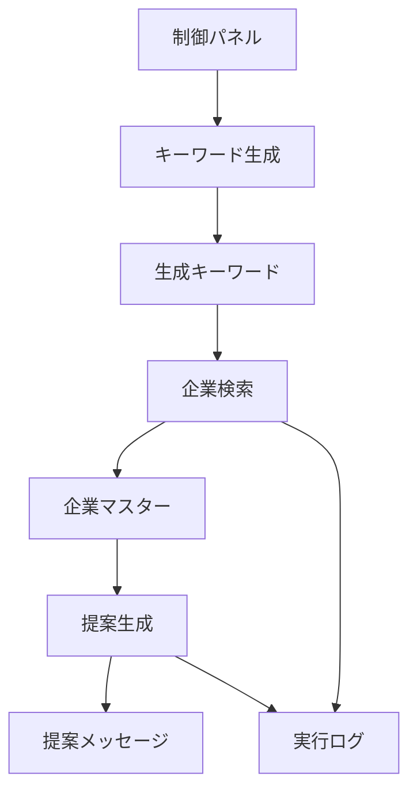
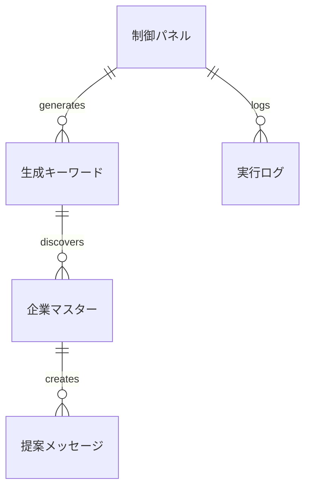

# 📊 データ構造仕様書

**営業自動化システム**  
**バージョン**: 1.0.0  
**作成日**: 2025年10月17日  

---

## 📑 目次

1. [概要](#概要)
2. [スプレッドシート構成](#スプレッドシート構成)
3. [データモデル](#データモデル)
4. [データ制約](#データ制約)
5. [データフロー](#データフロー)
6. [バックアップ戦略](#バックアップ戦略)

---

## 🎯 概要

営業自動化システムで使用するすべてのデータ構造を定義します。Google スプレッドシートをデータストレージとして使用し、5つのシートでデータを管理します。

## 📋 スプレッドシート構成

### シート一覧
1. **制御パネル** - システム設定・操作UI
2. **生成キーワード** - AI生成された検索キーワード
3. **企業マスター** - 発見された企業情報
4. **提案メッセージ** - 個別最適化された提案文
5. **実行ログ** - システム実行履歴

---

## 📊 データモデル

### 1. 制御パネル (Sheet: 制御パネル)

#### 設定エリア (A1:B12)
| セル | 項目名 | データ型 | デフォルト値 | 説明 |
|------|--------|----------|-------------|------|
| A1 | システムタイトル | 固定値 | "営業自動化システム" | システム識別子 |
| A2 | 商材名 | 文字列 | - | ユーザー入力必須 |
| A3 | 商材概要 | 文字列 | - | ユーザー入力必須 |
| A4 | 価格帯 | 選択肢 | "中価格" | 低価格/中価格/高価格 |
| A5 | 対象企業規模 | 選択肢 | "中小企業" | 個人事業主/中小企業/大企業/すべて |
| A6 | 優先地域 | 文字列 | - | 任意入力 |
| A8 | 実行ボタン1 | ボタン | "キーワード生成" | 機能実行トリガー |
| B8 | 実行ボタン2 | ボタン | "企業検索" | 機能実行トリガー |
| C8 | 実行ボタン3 | ボタン | "全自動実行" | 機能実行トリガー |
| A11 | 検索企業数上限 | 数値 | 20 | 1-100の範囲 |
| A12 | APIキー設定 | 表示 | "設定済み" | ステータス表示 |

#### ステータスエリア (A15:B20)
| セル | 項目名 | データ型 | 説明 |
|------|--------|----------|------|
| A15 | 実行状況 | 文字列 | リアルタイム進捗表示 |
| A16 | 最終実行時刻 | 日時 | 最後の実行タイムスタンプ |
| A17 | 処理中ステップ | 文字列 | 現在処理中の工程 |
| A18 | 成功件数 | 数値 | 直近実行の成功数 |
| A19 | エラー件数 | 数値 | 直近実行のエラー数 |
| A20 | 所要時間 | 文字列 | 処理時間（秒） |

#### ダッシュボード (D1:F10)
| セル | 項目名 | 計算式 | 説明 |
|------|--------|---------|------|
| D2 | 登録企業数 | `=COUNTA(企業マスター!A:A)-1` | 企業マスター総数 |
| D3 | 提案生成数 | `=COUNTA(提案メッセージ!A:A)-1` | 提案メッセージ総数 |
| D4 | 平均マッチ度 | `=AVERAGE(企業マスター!K:K)` | スコア平均値 |
| D5 | 最終実行日 | `=MAX(実行ログ!B:B)` | 最新の実行日時 |
| D6 | 今月実行回数 | 条件計算 | 当月の実行回数 |
| D7 | エラー率 | `=SUM(実行ログ!F:F)/SUM(実行ログ!E:E)` | 全体エラー率 |

### 2. 生成キーワード (Sheet: 生成キーワード)

#### テーブル構造
| 列 | 項目名 | データ型 | 制約 | 説明 |
|----|--------|----------|------|------|
| A | キーワード | VARCHAR(100) | NOT NULL, UNIQUE | 検索に使用するキーワード |
| B | カテゴリ | ENUM | NOT NULL | painPoint/growth/budget/timing |
| C | 優先度 | ENUM | NOT NULL | 高/中/低 |
| D | 戦略説明 | VARCHAR(500) | NULL | キーワード選定理由 |
| E | 実行済み | BOOLEAN | DEFAULT FALSE | 検索実行フラグ |
| F | ヒット件数 | INTEGER | DEFAULT 0 | 検索結果数 |
| G | 最終実行日 | DATETIME | NULL | 最後の実行日時 |

#### サンプルデータ
```
キーワード              | カテゴリ    | 優先度 | 戦略説明
DX推進 課題             | painPoint   | 高     | デジタル変革に課題を抱える企業を発見
急成長 スタートアップ   | growth      | 高     | 成長段階の企業をターゲット
IT投資 予算確保         | budget      | 中     | IT予算のある企業を特定
システム導入 検討中     | timing      | 高     | 導入タイミングの企業を発見
```

### 3. 企業マスター (Sheet: 企業マスター)

#### テーブル構造
| 列 | 項目名 | データ型 | 制約 | 説明 |
|----|--------|----------|------|------|
| A | 企業ID | INTEGER | PRIMARY KEY | 自動採番ID |
| B | 会社名 | VARCHAR(100) | NOT NULL | 正式会社名 |
| C | 公式URL | VARCHAR(500) | NOT NULL | メインウェブサイト |
| D | 業界 | VARCHAR(50) | NOT NULL | 業界分類 |
| E | 従業員数 | INTEGER | NULL | 概算従業員数 |
| F | 本社所在地 | VARCHAR(100) | NULL | 都道府県市区町村 |
| G | 問合せ方法 | VARCHAR(50) | NOT NULL | 連絡手段 |
| H | 上場区分 | VARCHAR(20) | NOT NULL | 上場/非上場 |
| I | 事業内容 | TEXT | NULL | 主要事業の説明 |
| J | 企業規模判定 | VARCHAR(30) | NOT NULL | 規模分類 |
| K | マッチ度スコア | INTEGER | NOT NULL | 0-100の適合度 |
| L | 発見キーワード | VARCHAR(100) | NOT NULL | 検索に使用したキーワード |
| M | 登録日時 | DATETIME | NOT NULL | データ登録日時 |

#### 業界分類
- IT・ソフトウェア
- 製造業
- サービス業
- 金融・保険
- 医療・福祉
- 教育・研修
- 不動産・建設
- 小売・流通
- その他

#### 企業規模判定
- 大企業 (従業員300名以上)
- 中小企業 (従業員10-299名)
- スタートアップ (従業員1-9名)
- 個人事業主

#### 問合せ方法
- フォーム
- 電話
- メール
- フォーム・電話
- その他

### 4. 提案メッセージ (Sheet: 提案メッセージ)

#### テーブル構造
| 列 | 項目名 | データ型 | 制約 | 説明 |
|----|--------|----------|------|------|
| A | 企業ID | INTEGER | FOREIGN KEY | 企業マスターとの紐付け |
| B | 提案パターンA_件名 | VARCHAR(50) | NOT NULL | 課題訴求型件名 |
| C | 提案パターンA_本文 | TEXT | NOT NULL | 課題訴求型本文 |
| D | 提案パターンB_件名 | VARCHAR(50) | NOT NULL | 成功事例型件名 |
| E | 提案パターンB_本文 | TEXT | NOT NULL | 成功事例型本文 |
| F | フォーム用メッセージ | VARCHAR(200) | NOT NULL | 短縮版メッセージ |
| G | 推奨アプローチ方法 | CHAR(1) | NOT NULL | A/B/フォーム |
| H | 想定課題 | VARCHAR(300) | NULL | 企業の想定課題 |
| I | 提供価値 | VARCHAR(300) | NULL | 商材の価値提案 |
| J | アプローチタイミング | VARCHAR(100) | NULL | 最適なタイミング |
| K | 生成日時 | DATETIME | NOT NULL | 提案作成日時 |

#### 文字数制約
| 項目 | 最小文字数 | 最大文字数 | 推奨文字数 |
|------|-----------|-----------|-----------|
| 件名A/B | 5 | 50 | 20-30 |
| 本文A/B | 100 | 500 | 250-350 |
| フォーム用 | 50 | 200 | 100-150 |
| 想定課題 | 10 | 300 | 50-100 |
| 提供価値 | 10 | 300 | 50-100 |

### 5. 実行ログ (Sheet: 実行ログ)

#### テーブル構造
| 列 | 項目名 | データ型 | 制約 | 説明 |
|----|--------|----------|------|------|
| A | 実行ID | INTEGER | PRIMARY KEY | 自動採番ID |
| B | 実行日時 | DATETIME | NOT NULL | 処理開始時刻 |
| C | 実行タイプ | VARCHAR(30) | NOT NULL | 処理の種類 |
| D | 対象キーワード | VARCHAR(100) | NULL | 処理対象 |
| E | 成功件数 | INTEGER | NOT NULL | 正常処理数 |
| F | エラー件数 | INTEGER | NOT NULL | エラー発生数 |
| G | エラー詳細 | TEXT | NULL | エラーメッセージ |
| H | 処理時間 | INTEGER | NOT NULL | 秒単位の所要時間 |
| I | API使用量 | INTEGER | NOT NULL | API呼び出し回数 |

#### 実行タイプ
- キーワード生成
- 企業検索
- 提案生成
- 全自動実行
- システム初期化
- データクリア

---

## 🔒 データ制約

### 1. 主キー制約
```sql
-- 企業マスター
PRIMARY KEY (企業ID)

-- 実行ログ  
PRIMARY KEY (実行ID)
```

### 2. 外部キー制約
```sql
-- 提案メッセージ → 企業マスター
FOREIGN KEY (企業ID) REFERENCES 企業マスター(企業ID)
```

### 3. ユニーク制約
```sql
-- 企業マスター
UNIQUE (会社名, 公式URL)

-- 生成キーワード
UNIQUE (キーワード)
```

### 4. NOT NULL制約
- すべてのIDフィールド
- 企業名、URL、業界
- 実行日時、処理時間
- マッチ度スコア

### 5. 値域制約
```sql
-- マッチ度スコア
CHECK (マッチ度スコア BETWEEN 0 AND 100)

-- 従業員数
CHECK (従業員数 >= 0)

-- 処理時間
CHECK (処理時間 >= 0)
```

### 6. 列挙型制約
```sql
-- 価格帯
ENUM ('低価格', '中価格', '高価格')

-- 対象企業規模  
ENUM ('個人事業主', '中小企業', '大企業', 'すべて')

-- キーワードカテゴリ
ENUM ('painPoint', 'growth', 'budget', 'timing')

-- 優先度
ENUM ('高', '中', '低')
```

---

## 🔄 データフロー

### 1. 基本フロー


### 2. データ依存関係


### 3. 処理順序
1. **入力フェーズ**: 制御パネルで設定値入力
2. **生成フェーズ**: キーワード生成 → 生成キーワードシート
3. **検索フェーズ**: 企業検索 → 企業マスターシート
4. **提案フェーズ**: 提案生成 → 提案メッセージシート
5. **ログフェーズ**: 各処理の結果 → 実行ログシート

---

## 💾 バックアップ戦略

### 1. 自動バックアップ
- **Google Drive版履歴**: 30日間の自動保存
- **スプレッドシート復元**: 版履歴からの復元機能

### 2. 手動バックアップ
- **週次バックアップ**: 毎週金曜日に完全コピー作成
- **月次アーカイブ**: 月末に長期保存用コピー作成

### 3. データエクスポート
```javascript
function exportAllData() {
  const sheets = ['制御パネル', '生成キーワード', '企業マスター', '提案メッセージ', '実行ログ'];
  
  sheets.forEach(sheetName => {
    const sheet = SpreadsheetApp.getActiveSpreadsheet().getSheetByName(sheetName);
    const data = sheet.getDataRange().getValues();
    
    // CSV形式でエクスポート
    const csv = convertToCSV(data);
    DriveApp.createFile(`${sheetName}_${getDateString()}.csv`, csv);
  });
}
```

### 4. 復旧手順
1. **軽微な問題**: 版履歴からの復元
2. **シート削除**: 手動バックアップからの復元
3. **完全損失**: アーカイブからの復元

---

## 📊 データ保持ポリシー

### 保持期間
| データタイプ | 保持期間 | 理由 |
|-------------|----------|------|
| 企業マスター | 2年 | 営業履歴の追跡 |
| 提案メッセージ | 1年 | 成功パターン分析 |
| 実行ログ | 6ヶ月 | システム監視 |
| 生成キーワード | 6ヶ月 | 戦略改善 |

### クリーンアップ
```javascript
function cleanupOldData() {
  const sixMonthsAgo = new Date();
  sixMonthsAgo.setMonth(sixMonthsAgo.getMonth() - 6);
  
  const logSheet = SpreadsheetApp.getActiveSpreadsheet().getSheetByName('実行ログ');
  const data = logSheet.getDataRange().getValues();
  
  // 6ヶ月以前のログを削除
  for (let i = data.length - 1; i >= 1; i--) {
    if (new Date(data[i][1]) < sixMonthsAgo) {
      logSheet.deleteRow(i + 1);
    }
  }
}
```

---

**このデータ構造仕様書は、営業自動化システムのデータ設計の完全な定義です。開発・運用時の参照資料として活用してください。**
