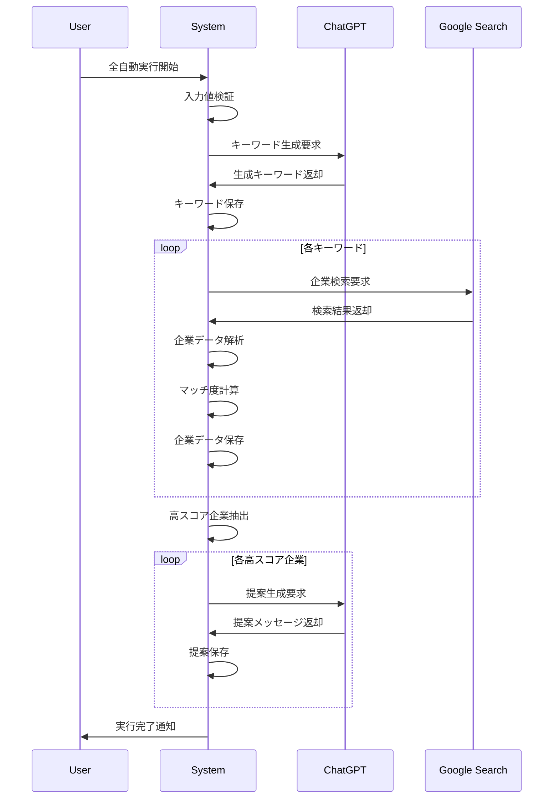
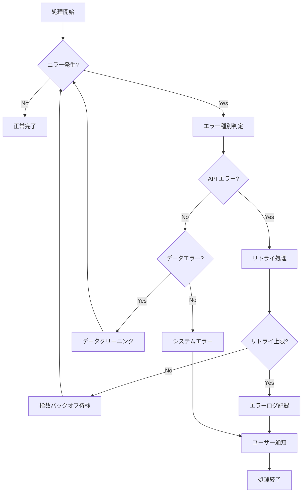

# 技術仕様書 - 営業自動化システム v2.0

## 📋 技術概要

### アーキテクチャ
- **プラットフォーム**: Google Apps Script (GAS)
- **ランタイム**: V8 Engine
- **データストレージ**: Google Spreadsheets
- **デプロイメント**: Clasp CLI
- **バージョン管理**: Git + GitHub

### 技術スタック
```yaml
Runtime: Google Apps Script V8
Language: JavaScript ES6+
APIs:
  - OpenAI ChatGPT API v3.5-turbo
  - Google Custom Search API v1
  - Google Sheets API v4
Authentication: OAuth 2.0
Development Tools:
  - Clasp CLI
  - VS Code
  - Git
```

---

## 🏗️ モジュール設計

### コアモジュール

#### 1. メニューシステム (`menu.js`)
```javascript
// 管理者・一般ユーザー分離メニューシステム
class AdaptiveMenuSystem {
  constructor() {
    this.licenseManager = new EnhancedLicenseManager();
    this.ui = SpreadsheetApp.getUi();
  }
  
  // メインメニュー生成（管理者モードに応じて分岐）
  buildMainMenu() {
    const isAdminMode = this.licenseManager.getAdminModeStatus();
    const licenseStatus = this.licenseManager.checkLicenseValidity();
    
    if (!licenseStatus.isValid) {
      this.buildExpiredMenu();
      return;
    }
    
    if (isAdminMode) {
      this.buildAdminMenu();
    } else {
      this.buildUserMenu();
    }
  }
  
  // 一般ユーザーメニュー
  buildUserMenu() {
    const menu = this.ui.createMenu('📊 営業支援システム');
    
    // 基本機能
    menu.addSubMenu(this.buildSearchMenu());
    menu.addSubMenu(this.buildProposalMenu());
    menu.addSubMenu(this.buildAnalysisMenu());
    menu.addSeparator();
    
    // サポート機能
    menu.addSubMenu(this.buildHelpMenu());
    
    menu.addToUi();
  }
  
  // 管理者メニュー
  buildAdminMenu() {
    const menu = this.ui.createMenu('🔧 営業支援システム (管理者)');
    
    // 通常機能
    menu.addSubMenu(this.buildSearchMenu());
    menu.addSubMenu(this.buildProposalMenu());
    menu.addSubMenu(this.buildAnalysisMenu());
    menu.addSeparator();
    
    // 管理機能
    menu.addSubMenu(this.buildManagementMenu());
    menu.addSeparator();
    
    // サポート機能
    menu.addSubMenu(this.buildHelpMenu());
    
    menu.addToUi();
  }
  
  // 期限切れメニュー
  buildExpiredMenu() {
    const menu = this.ui.createMenu('⚠️ システム期限切れ');
    
    menu.addItem('📋 ライセンス状況確認', 'showLicenseStatus');
    menu.addItem('💳 課金手続きガイド', 'showPricingGuide');
    menu.addSeparator();
    menu.addItem('🔐 管理者ログイン', 'promptAdminLogin');
    
    menu.addToUi();
  }
  
  // 検索メニュー
  buildSearchMenu() {
    const searchMenu = this.ui.createMenu('🔍 企業検索・分析');
    
    searchMenu.addItem('🎯 キーワード生成（ChatGPT）', 'generateKeywords');
    searchMenu.addItem('🏢 企業検索（Google）', 'searchCompanies');
    searchMenu.addItem('📊 マッチング分析', 'analyzeMatching');
    
    return searchMenu;
  }
  
  // 提案書メニュー
  buildProposalMenu() {
    const proposalMenu = this.ui.createMenu('📝 提案書作成');
    
    proposalMenu.addItem('✨ AI提案書生成', 'generateProposal');
    proposalMenu.addItem('📋 提案書テンプレート', 'insertProposalTemplate');
    proposalMenu.addItem('🎨 プレゼン資料生成', 'generatePresentation');
    
    return proposalMenu;
  }
  
  // 分析メニュー
  buildAnalysisMenu() {
    const analysisMenu = this.ui.createMenu('📈 分析・評価');
    
    analysisMenu.addItem('🎯 スコアリング実行', 'runScoring');
    analysisMenu.addItem('📊 レスポンス分析', 'analyzeResponse');
    analysisMenu.addItem('📋 レポート生成', 'generateReport');
    
    return analysisMenu;
  }
  
  // 管理機能メニュー（管理者限定）
  buildManagementMenu() {
    const managementMenu = this.ui.createMenu('⚙️ システム管理');
    
    managementMenu.addItem('🔐 管理者モード切替', 'toggleAdminMode');
    managementMenu.addItem('� 使用開始日設定', 'setLicenseStartDate');
    managementMenu.addItem('💳 課金状況管理', 'manageBilling');
    managementMenu.addSeparator();
    managementMenu.addItem('� システム設定', 'showSystemSettings');
    managementMenu.addItem('📊 利用統計表示', 'showUsageStatistics');
    managementMenu.addItem('🗂️ データエクスポート', 'exportSystemData');
    
    return managementMenu;
  }
  
  // ヘルプメニュー
  buildHelpMenu() {
    const helpMenu = this.ui.createMenu('❓ ヘルプ・サポート');
    
    helpMenu.addItem('� 使い方ガイド', 'showUserGuide');
    helpMenu.addItem('💰 料金・API利用ガイド', 'showPricingGuide');
    helpMenu.addItem('🔧 トラブルシューティング', 'showTroubleshooting');
    helpMenu.addSeparator();
    helpMenu.addItem('📞 サポート問い合わせ', 'contactSupport');
    helpMenu.addItem('� システム更新確認', 'checkSystemUpdates');
    
    return helpMenu;
  }
  
  // ライセンス状況表示
  showLicenseStatus() {
    const licenseStatus = this.licenseManager.checkLicenseValidity();
    const startDate = this.licenseManager.settingsSheet.getRange('B3').getValue();
    const billingStatus = this.licenseManager.settingsSheet.getRange('B4').getValue();
    
    let message = '� ライセンス状況\n\n';
    message += `使用開始日: ${startDate || '未設定'}\n`;
    message += `課金状況: ${billingStatus}\n`;
    message += `有効性: ${licenseStatus.isValid ? '✅ 有効' : '❌ 無効'}\n`;
    message += `理由: ${licenseStatus.reason}\n\n`;
    
    if (!licenseStatus.isValid) {
      message += '継続利用には課金が必要です。\n';
      message += '「料金・API利用ガイド」で詳細をご確認ください。';
    }
    
    this.ui.alert('ライセンス状況', message, this.ui.ButtonSet.OK);
  }
  
  // 管理者ログイン
  promptAdminLogin() {
    const response = this.ui.prompt(
      '🔐 管理者ログイン',
      '管理者パスワードを入力してください：',
      this.ui.ButtonSet.OK_CANCEL
    );
    
    if (response.getSelectedButton() === this.ui.Button.OK) {
      const inputPassword = response.getResponseText();
      const savedPassword = this.licenseManager.settingsSheet.getRange('B7').getValue();
      
      // パスワード検証（暗号化されたものと比較）
      if (Utilities.base64Encode(inputPassword) === savedPassword) {
        this.licenseManager.setAdminModeStatus(true);
        this.ui.alert('✅ ログイン成功\n\n管理者モードに切り替わりました。\nページを更新してください。');
      } else {
        this.ui.alert('❌ ログイン失敗\n\nパスワードが正しくありません。');
      }
    }
  }
  
  // システム設定表示
  showSystemSettings() {
    const sheet = this.licenseManager.settingsSheet;
    let message = '⚙️ システム設定\n\n';
    
    for (let i = 2; i <= 7; i++) {
      const setting = sheet.getRange(i, 1).getValue();
      const value = sheet.getRange(i, 2).getValue();
      const description = sheet.getRange(i, 3).getValue();
      
      message += `${setting}: ${value}\n`;
      message += `  → ${description}\n\n`;
    }
    
    this.ui.alert('システム設定', message, this.ui.ButtonSet.OK);
  }
  
  // 利用統計表示
  showUsageStatistics() {
    // 実装例：各機能の利用回数を追跡
    let stats = '📊 利用統計\n\n';
    stats += 'この機能は今後のバージョンで実装予定です。\n';
    stats += '予定機能：\n';
    stats += '• API利用回数追跡\n';
    stats += '• 機能別使用頻度\n';
    stats += '• パフォーマンス統計\n';
    stats += '• コスト分析';
    
    this.ui.alert('利用統計', stats, this.ui.ButtonSet.OK);
  }
  
  // データエクスポート
  exportSystemData() {
    this.ui.alert(
      '�️ データエクスポート',
      'この機能は今後のバージョンで実装予定です。\n\n予定機能：\n• 設定データのバックアップ\n• 利用履歴のエクスポート\n• システム診断レポート',
      this.ui.ButtonSet.OK
    );
  }
}

// メニュー初期化関数
function onOpen() {
  const menuSystem = new AdaptiveMenuSystem();
  menuSystem.buildMainMenu();
}

// 各メニュー項目の実装関数
function toggleAdminMode() {
  const licenseManager = new EnhancedLicenseManager();
  licenseManager.toggleAdminMode();
}

function setLicenseStartDate() {
  const licenseManager = new EnhancedLicenseManager();
  licenseManager.setLicenseStartDate();
}

function manageBilling() {
  const licenseManager = new EnhancedLicenseManager();
  licenseManager.manageBilling();
}

function showLicenseStatus() {
  const menuSystem = new AdaptiveMenuSystem();
  menuSystem.showLicenseStatus();
}

function promptAdminLogin() {
  const menuSystem = new AdaptiveMenuSystem();
  menuSystem.promptAdminLogin();
}

function showSystemSettings() {
  const menuSystem = new AdaptiveMenuSystem();
  menuSystem.showSystemSettings();
}

function showUsageStatistics() {
  const menuSystem = new AdaptiveMenuSystem();
  menuSystem.showUsageStatistics();
}

function exportSystemData() {
  const menuSystem = new AdaptiveMenuSystem();
  menuSystem.exportSystemData();
}
---

## 🔧 API統合仕様

### OpenAI ChatGPT API

#### 認証
```javascript
const OPENAI_API_KEY = PropertiesService.getScriptProperties().getProperty('OPENAI_API_KEY');

const headers = {
  'Authorization': `Bearer ${OPENAI_API_KEY}`,
  'Content-Type': 'application/json'
};
```

#### リクエスト形式
```javascript
const requestBody = {
  model: 'gpt-3.5-turbo',
  messages: [
    {
      role: 'system',
      content: '営業戦略専門家として行動してください'
    },
    {
      role: 'user',
      content: productAnalysisPrompt
    }
  ],
  max_tokens: 1000,
  temperature: 0.7
};
```

### Google Custom Search API

#### 認証・設定
```javascript
const GOOGLE_API_KEY = PropertiesService.getScriptProperties().getProperty('GOOGLE_API_KEY');
const CUSTOM_SEARCH_ENGINE_ID = PropertiesService.getScriptProperties().getProperty('CSE_ID');
```

#### 検索実行
```javascript
const searchUrl = `https://www.googleapis.com/customsearch/v1?key=${GOOGLE_API_KEY}&cx=${CUSTOM_SEARCH_ENGINE_ID}&q=${encodeURIComponent(query)}`;
```

---

## 📋 データ仕様

### システム設定シート
| 項目 | データ型 | 制約 | 説明 |
|------|----------|------|------|
| 管理者モード | Boolean | true/false | 管理者メニュー表示制御 |
| 使用開始日 | Date | YYYY-MM-DD | 10営業日試用期間の起点 |
| 課金状況 | String | trial/paid/expired | ライセンス状態 |
| 管理者パスワード | String | 暗号化済み | Base64エンコード |

### 企業データ構造
```javascript
const companyData = {
  name: String,           // 企業名
  url: String,           // ウェブサイトURL
  industry: String,      // 業界
  size: String,          // 企業規模
  contact: Object,       // 連絡先情報
  matchScore: Number,    // マッチングスコア
  keywords: Array,       // 関連キーワード
  lastUpdated: Date      // 最終更新日
};
```

---

## 🚀 今後の実装計画

### Phase 1: 管理者・ユーザー分離（優先度：高）
- [ ] AdaptiveMenuSystemクラスの実装
- [ ] EnhancedLicenseManagerクラスの実装
- [ ] システム設定シートの自動生成
- [ ] 管理者認証システム

### Phase 2: ライセンス管理強化（優先度：中）
- [ ] 営業日ベース期限計算
- [ ] 日本の祝日対応
- [ ] 課金状況追跡
- [ ] 利用統計機能

### Phase 3: 拡張機能（優先度：低）
- [ ] データエクスポート機能
- [ ] システム診断機能
- [ ] パフォーマンス監視
- [ ] 自動更新チェック

---

## 📊 パフォーマンス仕様

### API利用制限
- **ChatGPT API**: 1分間あたり最大3リクエスト
- **Google Search API**: 1日あたり100クエリ
- **実行時間制限**: 6分以内

### メモリ使用量
- **最大処理行数**: 1,000行
- **一時データ保存**: PropertiesServiceを活用
- **ログ保持期間**: 30日間

---

*この技術仕様書は営業支援システム v2.0 の完全な実装ガイドです。*
  getJapaneseHolidays() {
    const currentYear = new Date().getFullYear();
    return [
      `${currentYear}-01-01`, // 元日
      `${currentYear}-01-08`, // 成人の日（第2月曜日の簡易計算）
      `${currentYear}-02-11`, // 建国記念の日
      `${currentYear}-03-20`, // 春分の日（概算）
      `${currentYear}-04-29`, // 昭和の日
      `${currentYear}-05-03`, // 憲法記念日
      `${currentYear}-05-04`, // みどりの日
      `${currentYear}-05-05`, // こどもの日
      `${currentYear}-07-15`, // 海の日（第3月曜日の簡易計算）
      `${currentYear}-08-11`, // 山の日
      `${currentYear}-09-16`, // 敬老の日（第3月曜日の簡易計算）
      `${currentYear}-09-22`, // 秋分の日（概算）
      `${currentYear}-10-14`, // 体育の日（第2月曜日の簡易計算）
      `${currentYear}-11-03`, // 文化の日
      `${currentYear}-11-23`, // 勤労感謝の日
      `${currentYear}-12-23`  // 天皇誕生日
    ];
  }
  
  // 管理者モード制御
  toggleAdminMode() {
    const currentMode = this.getAdminModeStatus();
    this.setAdminModeStatus(!currentMode);
    
    // メニュー再構築のため画面リフレッシュを促す
    SpreadsheetApp.getUi().alert(
      '管理者モード切替完了\n\nページを更新してメニューの変更を反映してください。'
    );
  }
  
  getAdminModeStatus() {
    return this.settingsSheet.getRange('B2').getValue() === true;
  }
  
  setAdminModeStatus(status) {
    this.settingsSheet.getRange('B2').setValue(status);
    this.settingsSheet.getRange('C2').setValue(
      status ? '管理者メニュー表示中' : '一般ユーザーメニュー'
    );
  }
  
  // 使用開始日設定
  setLicenseStartDate() {
    const ui = SpreadsheetApp.getUi();
    const response = ui.prompt(
      '使用開始日設定',
      'YYYY-MM-DD 形式で使用開始日を入力してください\n（例: 2025-10-17）',
      ui.ButtonSet.OK_CANCEL
    );
    
    if (response.getSelectedButton() === ui.Button.OK) {
      const dateText = response.getResponseText();
      
      if (this.isValidDate(dateText)) {
        this.settingsSheet.getRange('B3').setValue(dateText);
        
        // ライセンス期限を自動計算
        const expiryDate = this.calculateExpiryDate(new Date(dateText));
        this.settingsSheet.getRange('B6').setValue(this.formatDate(expiryDate));
        
        ui.alert('✅ 設定完了\n\n使用開始日を設定しました。\n10営業日後に期限切れとなります。');
      } else {
        ui.alert('❌ 入力エラー\n\n正しい日付形式で入力してください。');
      }
    }
  }
  
  // 期限日計算（営業日ベース）
  calculateExpiryDate(startDate) {
    const holidays = this.getJapaneseHolidays();
    let businessDaysAdded = 0;
    const current = new Date(startDate);
    
    while (businessDaysAdded < this.trialDays) {
      current.setDate(current.getDate() + 1);
      const dayOfWeek = current.getDay();
      const dateString = this.formatDate(current);
      
      // 土日祝日でない場合のみカウント
      if (dayOfWeek !== 0 && dayOfWeek !== 6 && !holidays.includes(dateString)) {
        businessDaysAdded++;
      }
    }
    
    return current;
  }
  
  // 課金状況管理
  manageBilling() {
    const ui = SpreadsheetApp.getUi();
    const currentStatus = this.settingsSheet.getRange('B4').getValue();
    
    let statusText = '💳 課金状況管理\n\n';
    statusText += `現在の状況: ${currentStatus}\n\n`;
    
    if (currentStatus === 'trial') {
      statusText += '試用期間中です。\n';
      statusText += '継続利用には課金が必要です。\n\n';
      statusText += '課金完了後、この画面で「paid」に変更してください。';
    } else if (currentStatus === 'paid') {
      statusText += '課金済みです。\n';
      statusText += 'システムは継続利用可能です。';
    } else {
      statusText += '期限切れです。\n';
      statusText += '課金後、ステータスを更新してください。';
    }
    
    const response = ui.alert(
      statusText,
      '課金状況を「paid」に変更しますか？',
      ui.ButtonSet.YES_NO
    );
    
    if (response === ui.Button.YES) {
      this.settingsSheet.getRange('B4').setValue('paid');
      this.settingsSheet.getRange('B5').setValue(this.formatDate(new Date()));
      ui.alert('✅ 更新完了\n\n課金状況を「paid」に変更しました。');
    }
  }
  
  // ライセンス有効性チェック
  checkLicenseValidity() {
    const startDateText = this.settingsSheet.getRange('B3').getValue();
    const billingStatus = this.settingsSheet.getRange('B4').getValue();
    
    if (!startDateText) {
      return { isValid: false, reason: '使用開始日が未設定' };
    }
    
    if (billingStatus === 'paid') {
      return { isValid: true, reason: '課金済み' };
    }
    
    const startDate = new Date(startDateText);
    const today = new Date();
    const businessDaysUsed = this.calculateBusinessDays(startDate, today);
    
    if (businessDaysUsed >= this.trialDays) {
      return { isValid: false, reason: '試用期間終了' };
    }
    
    return { 
      isValid: true, 
      reason: `試用期間中（残り${this.trialDays - businessDaysUsed}営業日）` 
    };
  }
  
  // ユーティリティ関数
  isValidDate(dateString) {
    const regex = /^\d{4}-\d{2}-\d{2}$/;
    if (!regex.test(dateString)) return false;
    
    const date = new Date(dateString);
    return date instanceof Date && !isNaN(date);
  }
  
  formatDate(date) {
    return date.toISOString().split('T')[0];
  }
  
  encryptPassword(password) {
    // 簡易暗号化（実際の運用ではより強力な暗号化を推奨）
    return Utilities.base64Encode(password);
  }
}
```

#### 2. エラーハンドリング (`debug.js`)
```javascript
// 包括的エラー処理
class ErrorHandler {
  safeExecute(func, funcName, ...args) {
    try {
      console.log(`[DEBUG] Starting: ${funcName}`);
      const result = func.apply(this, args);
      console.log(`[DEBUG] Completed: ${funcName}`);
      return result;
    } catch (error) {
      this.logError(funcName, error);
      throw new DetailedError(funcName, error);
    }
  }
  
  logError(funcName, error) {
    const errorLog = {
      timestamp: new Date().toISOString(),
      function: funcName,
      error: error.toString(),
      stack: error.stack
    };
    
    Logger.log(JSON.stringify(errorLog));
    this.saveErrorToSheet(errorLog);
  }
}
```

---

## 🔧 API統合仕様

### OpenAI ChatGPT API

#### 認証
```javascript
const OPENAI_API_KEY = PropertiesService.getScriptProperties().getProperty('OPENAI_API_KEY');

const headers = {
  'Authorization': `Bearer ${OPENAI_API_KEY}`,
  'Content-Type': 'application/json'
};
```

#### リクエスト形式
```javascript
const payload = {
  model: 'gpt-3.5-turbo',
  messages: [
    {
      role: 'system',
      content: 'システムプロンプト'
    },
    {
      role: 'user',
      content: 'ユーザー入力'
    }
  ],
  max_tokens: 2000,
  temperature: 0.7
};
```

#### レスポンス処理
```javascript
function parseOpenAIResponse(response) {
  const data = JSON.parse(response.getContentText());
  
  if (data.error) {
    throw new Error(`OpenAI API Error: ${data.error.message}`);
  }
  
  return {
    content: data.choices[0].message.content,
    usage: data.usage,
    model: data.model
  };
}
```

### Google Custom Search API

#### 認証・設定
```javascript
const GOOGLE_SEARCH_API_KEY = PropertiesService.getScriptProperties().getProperty('GOOGLE_SEARCH_API_KEY');
const SEARCH_ENGINE_ID = PropertiesService.getScriptProperties().getProperty('GOOGLE_SEARCH_ENGINE_ID');
```

#### 検索実行
```javascript
function executeGoogleSearch(query, options = {}) {
  const baseUrl = 'https://www.googleapis.com/customsearch/v1';
  const params = {
    key: GOOGLE_SEARCH_API_KEY,
    cx: SEARCH_ENGINE_ID,
    q: query,
    num: options.num || 10,
    start: options.start || 1,
    lr: 'lang_ja',
    cr: 'countryJP'
  };
  
  const url = `${baseUrl}?${Object.entries(params).map(([k,v]) => `${k}=${encodeURIComponent(v)}`).join('&')}`;
  
  const response = UrlFetchApp.fetch(url);
  return JSON.parse(response.getContentText());
}
```

---

## 💾 データ管理仕様

### スプレッドシート構造

#### 制御パネルシート
```yaml
Row 1: ヘッダー
Row 2-10: 基本設定
  - B2: 商材名
  - B3: 商材概要
  - B4: 価格帯
  - B5: 対象企業規模
  - B6: 最大企業数
  - B7: ChatGPT API Key
  - B8: Google Search API Key
  - B9: Search Engine ID
Row 12-20: 実行ボタン
Row 22-30: ステータス表示
```

#### 企業マスターシート
```yaml
Columns:
  A: 企業ID (UUID)
  B: 企業名
  C: 業界
  D: 企業規模
  E: 従業員数
  F: ウェブサイト
  G: 連絡先情報
  H: マッチ度スコア
  I: 発見キーワード
  J: 最終更新日時
  K: ステータス
  L: 備考
```

### データバリデーション
```javascript
const ValidationRules = {
  companyName: {
    required: true,
    minLength: 2,
    maxLength: 100,
    pattern: /^[^<>{}[\]\\]+$/
  },
  
  employees: {
    type: 'number',
    min: 0,
    max: 1000000
  },
  
  matchScore: {
    type: 'number',
    min: 0,
    max: 100
  },
  
  website: {
    pattern: /^https?:\/\/.+/
  }
};
```

---

## 🔄 プロセスフロー

### 全自動ワークフロー


### エラー処理フロー


---

## 🚀 パフォーマンス最適化

### API呼び出し最適化
```javascript
class APIRateLimiter {
  constructor(maxRequestsPerMinute = 60) {
    this.maxRequests = maxRequestsPerMinute;
    this.requests = [];
  }
  
  async execute(apiCall) {
    await this.waitIfNeeded();
    this.requests.push(Date.now());
    
    try {
      return await apiCall();
    } catch (error) {
      if (this.isRateLimitError(error)) {
        await this.exponentialBackoff();
        return this.execute(apiCall);
      }
      throw error;
    }
  }
  
  async waitIfNeeded() {
    const now = Date.now();
    const oneMinuteAgo = now - 60000;
    
    this.requests = this.requests.filter(time => time > oneMinuteAgo);
    
    if (this.requests.length >= this.maxRequests) {
      const waitTime = this.requests[0] - oneMinuteAgo;
      await this.sleep(waitTime);
    }
  }
}
```

### メモリ管理
```javascript
class MemoryManager {
  static clearCache() {
    // スプレッドシートキャッシュをクリア
    SpreadsheetApp.flush();
    
    // 大きなオブジェクトを削除
    if (typeof globalThis.largeCacheObject !== 'undefined') {
      delete globalThis.largeCacheObject;
    }
    
    // ガベージコレクション推奨
    Utilities.sleep(100);
  }
  
  static batchProcess(items, batchSize = 10, processor) {
    const results = [];
    
    for (let i = 0; i < items.length; i += batchSize) {
      const batch = items.slice(i, i + batchSize);
      const batchResults = processor(batch);
      results.push(...batchResults);
      
      // バッチ間でメモリクリア
      if (i % (batchSize * 5) === 0) {
        this.clearCache();
      }
    }
    
    return results;
  }
}
```

---

## 🛡️ セキュリティ仕様

### API キー管理
```javascript
class SecureConfigManager {
  static setAPIKey(keyName, keyValue) {
    // 暗号化してプロパティサービスに保存
    const encrypted = this.encrypt(keyValue);
    PropertiesService.getScriptProperties().setProperty(keyName, encrypted);
  }
  
  static getAPIKey(keyName) {
    const encrypted = PropertiesService.getScriptProperties().getProperty(keyName);
    return encrypted ? this.decrypt(encrypted) : null;
  }
  
  static encrypt(text) {
    // 簡易暗号化（実装では強力な暗号化を推奨）
    return Utilities.base64Encode(text);
  }
  
  static decrypt(encryptedText) {
    return Utilities.base64Decode(encryptedText);
  }
}
```

### 入力値サニタイゼーション
```javascript
class InputSanitizer {
  static sanitizeText(input) {
    if (typeof input !== 'string') return '';
    
    return input
      .replace(/<script\b[^<]*(?:(?!<\/script>)<[^<]*)*<\/script>/gi, '') // スクリプトタグ除去
      .replace(/[<>'"&]/g, (match) => {
        const escapeMap = {
          '<': '&lt;',
          '>': '&gt;',
          '"': '&quot;',
          "'": '&#x27;',
          '&': '&amp;'
        };
        return escapeMap[match];
      })
      .trim()
      .substring(0, 1000); // 長さ制限
  }
  
  static validateEmail(email) {
    const emailRegex = /^[^\s@]+@[^\s@]+\.[^\s@]+$/;
    return emailRegex.test(email);
  }
  
  static validateURL(url) {
    try {
      new URL(url);
      return url.startsWith('http://') || url.startsWith('https://');
    } catch {
      return false;
    }
  }
}
```

---

## 📊 ログ・モニタリング仕様

### 統合ログシステム
```javascript
class Logger {
  static log(level, message, context = {}) {
    const logEntry = {
      timestamp: new Date().toISOString(),
      level: level.toUpperCase(),
      message: message,
      context: context,
      sessionId: this.getSessionId()
    };
    
    // Console.log
    console.log(JSON.stringify(logEntry));
    
    // Stackdriver Logging
    Logger.log(JSON.stringify(logEntry));
    
    // スプレッドシートログ
    this.writeToSheet(logEntry);
  }
  
  static info(message, context) {
    this.log('info', message, context);
  }
  
  static error(message, error, context) {
    this.log('error', message, {
      ...context,
      error: error.toString(),
      stack: error.stack
    });
  }
  
  static writeToSheet(logEntry) {
    try {
      const sheet = this.getLogSheet();
      sheet.appendRow([
        logEntry.timestamp,
        logEntry.level,
        logEntry.message,
        JSON.stringify(logEntry.context)
      ]);
    } catch (error) {
      // ログ書き込みエラーは無視（無限ループ防止）
    }
  }
}
```

---

## 🧪 テスト仕様

### 単体テスト例
```javascript
class TestSuite {
  static runAllTests() {
    const results = [];
    
    results.push(this.testKeywordGeneration());
    results.push(this.testScoreCalculation());
    results.push(this.testDataValidation());
    
    return results;
  }
  
  static testScoreCalculation() {
    const testData = {
      companySize: '中小企業',
      industry: 'IT',
      contactMethod: 'email',
      description: 'テスト企業'
    };
    
    const settings = {
      targetSize: '中小企業',
      targetIndustry: 'IT'
    };
    
    const score = calculateMatchScore(testData, settings);
    
    return {
      test: 'Score Calculation',
      passed: score >= 60 && score <= 100,
      result: score
    };
  }
}
```

---

## 🚀 デプロイメント

### Clasp設定
```json
{
  "scriptId": "1CJc_NYpMJ8veccfqtRbcf0C02a5eR24zcUxGJiP7SU_pf4g-vK6AHfSy",
  "parentId": ["1Q4i_GjDX1x_hWbqvRJDrmqizZMOZ8q-FjX_pf7eGPlM"],
  "rootDir": "./src"
}
```

### 自動デプロイ手順
```bash
# 1. ファイル変更
git add .
git commit -m "機能追加"

# 2. Google Apps Scriptにプッシュ
npx clasp push

# 3. 本番環境テスト
npx clasp open

# 4. バージョンタグ作成
git tag v2.0.1
git push origin v2.0.1
```

---

*最終更新: 2025年10月17日*  
*技術仕様書 v2.0*
